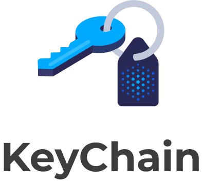

<p align="center">
  <br>
  
  <br>
  <br>
</p>

<<link rel="stylesheet" type="text/css" href="https://stackpath.bootstrapcdn.com/bootstrap/4.2.1/css/bootstrap.min.css">

<p align="center"><strong><a href="https://github.com/arrayio/array-io-keychain/releases/download/0.11/KeyChain.Installer.v0.11.zip">» Download for macOS «</a></strong></p>

<p align="center"><strong><a href="https://github.com/arrayio/array-io-keychain/releases/download/0.13/keychain.msi">» Download for Windows «</a></strong></p>

&nbsp;&nbsp;&nbsp;&nbsp;&nbsp;&nbsp;&nbsp;&nbsp;&nbsp;&nbsp;&nbsp;&nbsp;&nbsp;&nbsp;&nbsp;&nbsp;&nbsp;&nbsp;&nbsp;&nbsp;&nbsp;&nbsp;&nbsp;&nbsp;&nbsp;&nbsp;&nbsp;&nbsp;&nbsp;&nbsp;&nbsp;&nbsp;&nbsp;&nbsp;&nbsp;&nbsp;&nbsp;&nbsp;&nbsp;
&nbsp;&nbsp;&nbsp;&nbsp;&nbsp;&nbsp;&nbsp;&nbsp;&nbsp;&nbsp;&nbsp;&nbsp;&nbsp;[](https://twitter.com/intent/tweet?text=A%20good,%20solid%20app%20to%20keep%20your%20keys%20safe.&url=https://keychain.array.io/&via=ProjectArray&hashtags=cybersecurity,private,cryptography,blockchain,app) [](https://github.com/arrayio/array-io-keychain#contributing-to-the-project)
[](https://github.com/arrayio/array-io-keychain/blob/master/LICENSE.md) [](https://badge.fury.io/js/web3override) 

<p align="center"><strong><a href="https://avvrik.github.io/KeyChain/">» Documentation «</a></strong></p>

<p align="center"><strong><a href="https://keychain.array.io/">» Website «</a></strong></p>

<script src="https://code.jquery.com/jquery-3.3.1.min.js" integrity="sha256-FgpCb/KJQlLNfOu91ta32o/NMZxltwRo8QtmkMRdAu8=" crossorigin="anonymous"></script>


## Overview

**KeyChain** is a standalone app for signing transactions and generating key pairs. It stores private keys in an isolated environment where no logger, debugger or spyware can intercept them because of the [three-layer security](https://github.com/arrayio/array-io-keychain/wiki/KeyChain-security#three-security-layers-of-keychain) protecting each action of the system.
**KeyChain** supports transactions from and to various blockchains, including Ethereum and Ethereum classic, Litecoin, Bitcoin, Bitcoin Cash, and Bitshares.

## Table of contents

- [Installation](#installation)
- [Getting started](#getting-started)
- [How to use](#how-to-use)
- [Companies using KeyChain](#companies-using-keychain)
- [Contributing to the project](#contributing-to-the-project)
- [Contact](#contact)
- [License](#license)

## Installation

Download and install KeyChain for [macOS](https://github.com/arrayio/array-io-keychain/releases/download/0.11/KeyChain.Installer.v0.11.zip) and [Windows](https://github.com/arrayio/array-io-keychain/releases/download/0.13/keychain.msi). Linux installer is coming soon.

*Try out KeyChain on the [demo page](https://arrayio.github.io/array-io-keychain/demo/).*

After installation, connect to the demo-page: http://localhost:16384/ to check if the installation was successful and to test the KeyChain commands. In case everything went well, you will see the following page and you will be able to see responses to the commands in the "Response" box when you click on them.


If you are having trouble connecting to the page, [contact us](#contact) and we will do our best to help you.

You can find comprehensive installation guides for [macOS](https://github.com/arrayio/array-io-keychain/wiki/Installation-guide-for-macOS), [Windows](https://github.com/arrayio/array-io-keychain/wiki/Installation-guide-for-Windows), and [Linux](https://github.com/arrayio/array-io-keychain/wiki/Installation-guide-for-Linux) in our Wiki. 

## Getting started

After you have installed [KeyChain](https://github.com/arrayio/array-io-keychain/releases/download/0.11/KeyChain.Installer.v0.11.zip), you can start using it with web3. Just follow these simple steps.

1. Install `web3override` library from this [source](https://www.npmjs.com/package/web3override).

```
npm i --save web3override
```

Require it 
```javascript
const Module = require('web3override'); 
```

2. Now create a new key with KeyChain and use an overridden web3 function 

```javascript
// create new key in Keychain
const keyInstance = await Module.Keychain.create();
const data = await keyInstance.createKey('test1');
const key = data.result;
await keyInstance.term();

Module.override(web3);
// now we use web3 with keychain
await web3.eth.accounts.signTransaction(transactionParams, key); // overriden web3 function usage

```

`signTransaction` with Keychain in action


## Companies using KeyChain

- [Swap Online](https://swap.online/)

## Contributing to the project

The main purpose of this repository is to continue to evolve KeyChain core, making it faster and easier to use. Development of KeyChain happens in the open on GitHub, and we are grateful to the community for contributing bugfixes and improvements. 

### [Code of Conduct](https://github.com/arrayio/array-io-keychain/blob/master/CODE_OF_CONDUCT.md)

KeyChain has adopted a Code of Conduct that we expect project participants to adhere to. Please read [the full text](https://github.com/arrayio/array-io-keychain/blob/master/CODE_OF_CONDUCT.md) so that you can understand what actions will and will not be accepted.

To contribute or report a bug, you can [contact us](#contact) or create an [issue](https://github.com/arrayio/array-io-keychain/issues/new) with a label "bug".

## How to use 

For extensive documentation on KeyChain, refer to the [Wiki](https://github.com/arrayio/array-io-keychain/wiki).

There you will find:

- [Home](https://github.com/arrayio/array-io-keychain/wiki): how to navigate in our Wiki. 
- [How to sign an Ethereum transaction](https://github.com/arrayio/array-io-keychain/wiki/How-to-sign-Ethereum-transaction-via-KeyChain): a simple and precise tutorial.
- Installation guides for [macOS](https://github.com/arrayio/array-io-keychain/wiki/Installation-guide-for-macOS), [Windows](https://github.com/arrayio/array-io-keychain/wiki/Installation-guide-for-Windows), [Linux](https://github.com/arrayio/array-io-keychain/wiki/Installation-guide-for-Linux).
- [KeyChain Protocol](https://github.com/arrayio/array-io-keychain/wiki/KeyChain-Protocol): full comprehensive descriptions of the KeyChain commands.
- [KeyChain sample commands](https://github.com/arrayio/array-io-keychain/wiki/KeyChain-sample-commands): shortcut to using the commands.
- [Pipe API](https://github.com/arrayio/array-io-keychain/wiki/Pipe-API): integrating KeyChain through pipe.
- [Security](https://github.com/arrayio/array-io-keychain/wiki/Security): why KeyChain is highly secure.
- [Troubleshooting](https://github.com/arrayio/array-io-keychain/wiki/Troubleshooting): error handling, log files, debugging.
- [Useful reference](https://github.com/arrayio/array-io-keychain/wiki/Useful-reference): external links.
- [WebSocket API](https://github.com/arrayio/array-io-keychain/wiki/WebSocket-API): integrating KeyChain through WebSocket.

## Contact

If you need help interacting with KeyChain, please do not hesitate to contact us:

- [Telegram](https://t.me/arrayio)
- [Stackoverflow](https://stackoverflow.com/users/10429540/array-io)
- [Twitter](https://twitter.com/ProjectArray)
- Or you can write us an email to support@array.io. 

If you want to report a security issue, include the word "security" in the subject field.

We take security issues very seriously and we'll be looking forward to hearing from you. Still, we hope you enjoy using KeyChain and the integration goes smooth! 

## License

This project is licensed under the terms of the MIT license.
